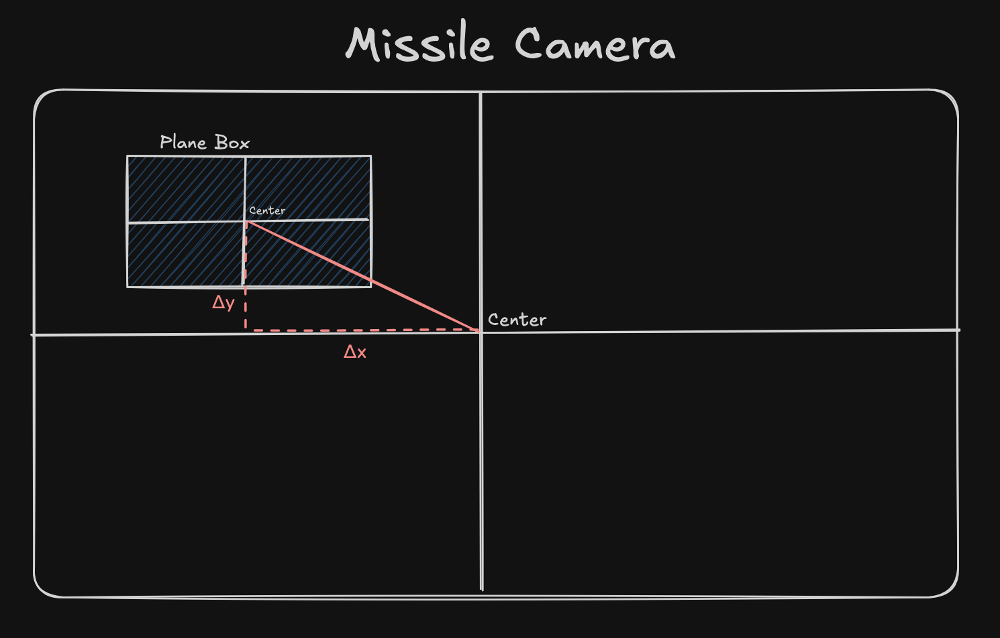

# 🎯 Argus - Vision-Guided Missile Simulation
<div align="center">

</div>

## 🌟 Overview
**Argus** is an advanced simulation that combines **machine learning** and **real-time 3D physics** to create a self-guided missile system. The project demonstrates how computer vision can be integrated into game engines for autonomous target tracking and interception.


Named after the [**Argus Panoptes**](en.wikipedia.org/wiki/Argus_Panoptes) from Greek mythology—a giant with a hundred eyes—this project embodies the concept of constant visual surveillance and intelligent tracking.
### Why This Project?
- 🧠 **AI Integration in Games**: Demonstrates real-world ML model deployment in Unity
- 🎮 **Realistic Physics**: Implements aerodynamic flight dynamics with lift, drag, and angle of attack
- 🎯 **Autonomous Guidance**: Uses proportional navigation based on real-time object detection
- 🔬 **Educational**: Perfect for learning ML inference, Unity Sentis, and game physics
---
## ✨ Features
### 🤖 Computer Vision & AI
- **YOLOv8 Object Detection** running in real-time on GPU
- **Unity Sentis Integration** for neural network inference
- **Single-class aircraft detection** optimized for accuracy
- **Real-time bounding box visualization** with confidence scores
### 🚁 Flight Physics
- **Realistic aerodynamic model** with lift/drag calculations
- **Angle of Attack (AoA)** based flight dynamics
- **Proportional Navigation** guidance system
- **Manual plane controls** with throttle, pitch, and roll
## 📦 Part 1: ArgusModel - ML Training & Export
### 🔬 What It Does
1. **Dataset Preparation**
   - Uses the [Kaggle Military Aircraft Detection Dataset](https://www.kaggle.com/datasets/a2015003713/militaryaircraftdetectiondataset)
   - All aircraft types merged into a single **"Plane"** class for maximum accuracy
   - Trained on Kaggle GPU (NVIDIA P100) in ~10 minutes
2. **Model Training**
   - **Architecture**: YOLOv8n (nano variant for real-time performance)
   - **Input Size**: 640×640 pixels
   - **Output**: Bounding boxes with confidence scores
3. **ONNX Export for Unity**


   ```python
   # main.py - Optimized export for Unity Sentis
   model.export(
       format='onnx',
       imgsz=640,
       simplify=True,
       opset=15,        # Sentis compatibility
       batch=1,         # Fixed batch size
       dynamic=False    # Static shapes for performance
   )
   ```
---
## 🎮 Part 2: ArgusSimulation - Unity 3D Simulation
**Engine**: Unity 2023.2.20f1


**How Guidance Works**:
1. Camera captures view → 640×640 render texture
2. Sentis runs YOLOv8 inference → detections `[x, y, w, h, confidence]`
3. Target center computed in screen space
4. Offset calculated: `(targetX - screenCenterX, targetY - screenCenterY)`
5. Missile rotates toward target: yaw ∝ offsetX, pitch ∝ offsetY
<div align="center">

</div>


## 📊 Technical Specifications

### Model Performance
| Metric | Value |
|--------|-------|
| Input Size | 640×640 RGB |
| Inference Time | ~16-30ms (GPU) |
| FPS | 30-60 |
| Confidence Threshold | 0.9 |
| Architecture | YOLOv8n |
### Physics Parameters
| Parameter | Default Value |
|-----------|---------------|
| Air Density | 1.225 kg/m³ |
| Wing Area | 16 m² |
| Max Thrust | 190 N |
| Lift Slope (ClAlpha) | 5.5 |
| Induced Drag (k) | 0.04 |
---
## 🎯 How It Works


### The Complete Pipeline
```
[Camera Feed] → [640×640 Tensor] → [YOLOv8 Sentis] → [Detections]
     ↑                                                      ↓
     └──[Missile Rotation]←[Proportional Navigation]←[Offset Calculation]
```


### Proportional Navigation Explained
The missile uses a classic guidance law:
1. **Detection**: YOLOv8 finds target bounding box `[x, y, w, h]`
2. **Center Calculation**: `targetCenter = (x + w/2, y + h/2)`
3. **Screen Offset**: `offset = targetCenter - screenCenter`
4. **Normalize**: `offsetNormalized = offset / screenSize × 2` → range `[-1, 1]`
5. **Apply Rotation**:
   ```csharp
   yaw += offsetX × rotationSpeed × deltaTime
   pitch += offsetY × rotationSpeed × deltaTime
   ```
This creates a smooth pursuit trajectory that leads the target!
---


## 🚀 Future Improvements
- [ ] **Hybrid Tracking**: Combine detection with Kalman filtering for smoother tracking
- [ ] **Multi-Target**: Track and prioritize multiple aircraft
- [ ] **Better Physics**: Add wind resistance, thrust vectoring, fuel consumption
- [ ] **Advanced UI**: HUD with radar, lock indicators, target info
- [ ] **Multiplayer**: Network-based dogfighting simulation
---


## 📚 References & Credits
  - [Unity Flight Physics - b3agz](https://www.youtube.com/watch?v=fThb5M2OBJ8)
  - [Unity Flight Physics - Vazgriz](https://www.youtube.com/watch?v=7vAHo2B1zLc)
